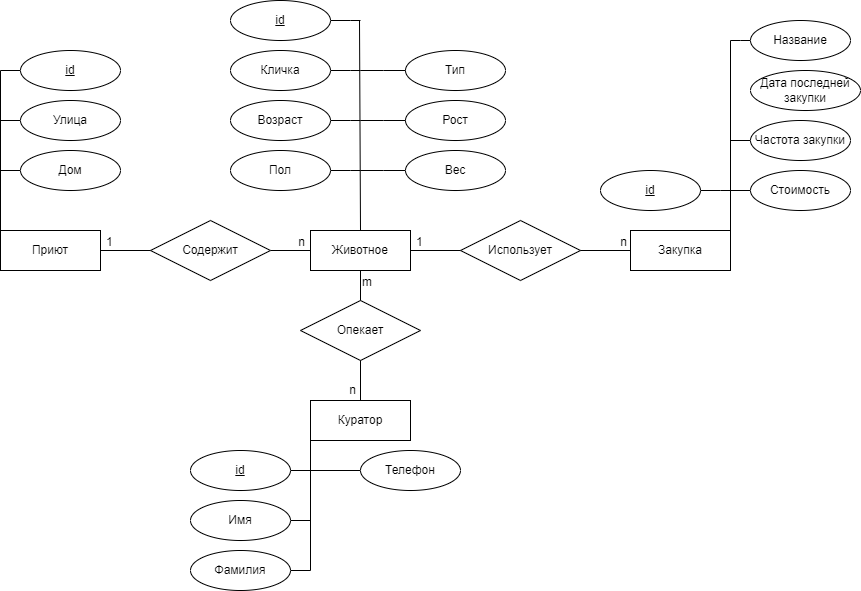
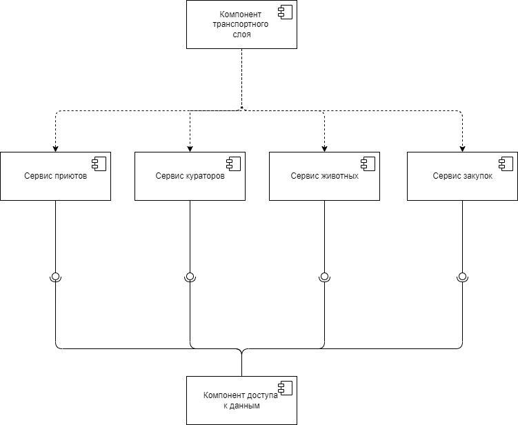

# Приложение для админстрирования благотворительного фонда помощи бездомным животным

## Краткое описание идеи проекта

Проект создан для кураторов благотворительных фондов.
Данная система предназначена для работы с подопечными (животными), будет содержать информацию о животных, местах их содержания и необходимых закупках.

## Краткое описание предметной области

Предметная область --- курирование животных в приютах: добавление и удаление животных у кураторов, просмотр и изменение данных о животных.

Сущности:

1. Животное --- сущность, описывающая животных. Основные параметры: кличка, вид (кошка, собака), приют.
2. Куратор --- сущность, описывающая кураторов. Основные параметры: ФИО, подопечные.
3. Приют --- сущность, описывающая место содержания животного. Основные параметры: улица, дом, этаж, квартира (для частных передержек).
4. Закупка --- сущность, описывающая необходимую закупку для животного. Основные параметры: название, стоимость и частота закупки.

## Краткий анализ аналогичных решений по 3-м критериям

|Название приложения|Возможность курировать конкретное животное|Отслеживание закупок корма|Открытость платформы|
|-------------------|------------------|---------------|---------------------------|---------------------------|
|ACITS|+|-|+|
|Помощник Рэй|-|+|+|

## Краткое описание целесообразности и актуальности проекта

Рассмотренные выше решения либо не позволяют брать под опеку конкретное животное (только выполнять различные "задачи" по разным животным), либо ориентированы на одну конкретную сферу ухода за животными (медицина), так же являются достаточно сложными в использовании.
Данный проект предназначен для упрощенного администрирования благотворительного фонда с ориентацией на опеку конкретных животных.

## Use-Case

## ER

## Пользовательские сценарии

1. Авторизоваться
2. Посмотреть доступные сценарии
3. Посмотреть информацию о себе
4. Добавить животное к себе
5. Перестать быть куратором животного
6. Посмотреть сведения о приюте
7. Вывести все приюты
8. Посмотреть сведения о животном
9. Изменить сведения о животном
10. Вывести своих животных
11. Вывести всех животных

## Формализация бизнес-правил, BPMN-диаграмма

## Описание типа приложения и технологического стека

Приложение типа телеграмм бот.

Технологический стек: 

- язык: `Golang` ,
- СУБД: `PostgreSQL`

## Верхнеуровневое разбиение на компоненты

## UML диаграммы классов

UML диаграмма сущностей системы: 

UML диаграмма компонента бизнес логики: 

UML диаграмма компонента доступа к данным: 

