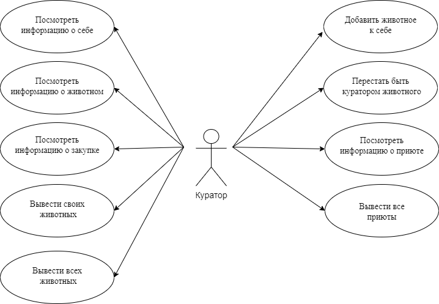
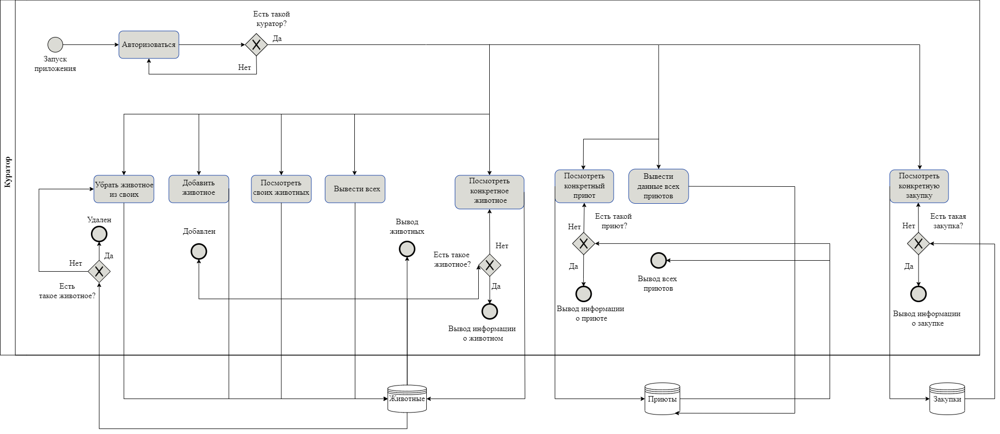

# Приложение для контроля за животными внутри благотворительного фонда

## Краткое описание идеи проекта

Проект создан для кураторов благотворительных фондов.
Приложение предназначено для работы с подопечными (животными), будет содержать информацию о животных, местах их содержания и необходимых закупках.

## Краткое описание предметной области

Предметная область - курирование животных в приютах: добавление и удаление животных у кураторов, просмотр и изменение данных о животных.

- Сущность __Животное__ содержит информацию о животном: кличка, вид (кошка, собака), приют.
- Сущность __Куратор__ содержит информацию о кураторе: ФИО, подопечные.
- Сущность __Приют__ содержит информацию о месте содержания животного: улица, дом.
- Сущность __Закупка__ содержит информацию о необходимой закупке для животного: название, стоимость, частота закупки и дата последней.

## Краткий анализ аналогичных решений по 3-м критериям

|Название|Возможность курировать конкретное животное|Возможность отслеживать закупки корма|Бесплатное использование
|-------------------|------------------|---------------|---------------------------|
|ACITS|+|-|+|
|Помощник Рэй|-|+|+|

## Краткое описание целесообразности и актуальности проекта

Рассмотренные выше решения либо не позволяют брать под опеку конкретное животное (только выполнять различные "задачи" по разным животным), либо ориентированы на одну конкретную сферу ухода за животными (медицина).
Проект предназначен для упрощенного контроля за животными внутри благотворительного фонда с ориентацией на опеку конкретных животных.

## Use-Case

## ER

## Пользовательские сценарии

1. Зарегистрироваться
2. Посмотреть информацию о себе
3. Добавить животное к себе
4. Перестать быть куратором животного
5. Посмотреть сведения о приюте
6. Вывести все приюты
7. Посмотреть сведения о животном
8. Посмотреть сведения о закупке
9. Вывести своих животных
10. Вывести всех животных

## Формализация бизнес-правил, BPMN-диаграмма

## Описание типа приложения и технологического стека

Тип приложения - телеграмм бот.

Технологический стек: 

- язык: `Golang` ,
- СУБД: `PostgreSQL`

## Верхнеуровневое разбиение на компоненты

## UML диаграммы классов

UML диаграмма сущностей системы: 

UML диаграмма компонента бизнес логики: 

UML диаграмма компонента доступа к данным: 

